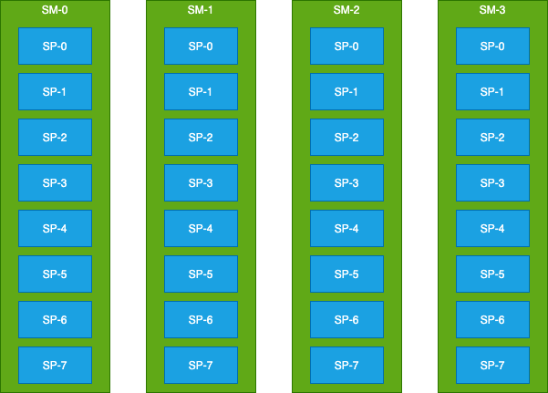

# tinyGPU

Designing a **SIMT (Single Instruction Multiple Thread) Processor** under **EN3030 Circuits and Systems** module.

The design is implemented in Verilog HDL and the assembly programs are simulated in Python.

## Overview

The ISA and Datapath can be found in the following [Google Sheet](https://docs.google.com/spreadsheets/d/1yPLuM_zCF1IhVchUTxWPucX_xoV9kUbVz8zwBgPuInc/edit#gid=853810905)
## ISA
//TODO

## Datapath

//TODO\

The information about the [RTL Modules](./Verilog/README.md)  can be found here

