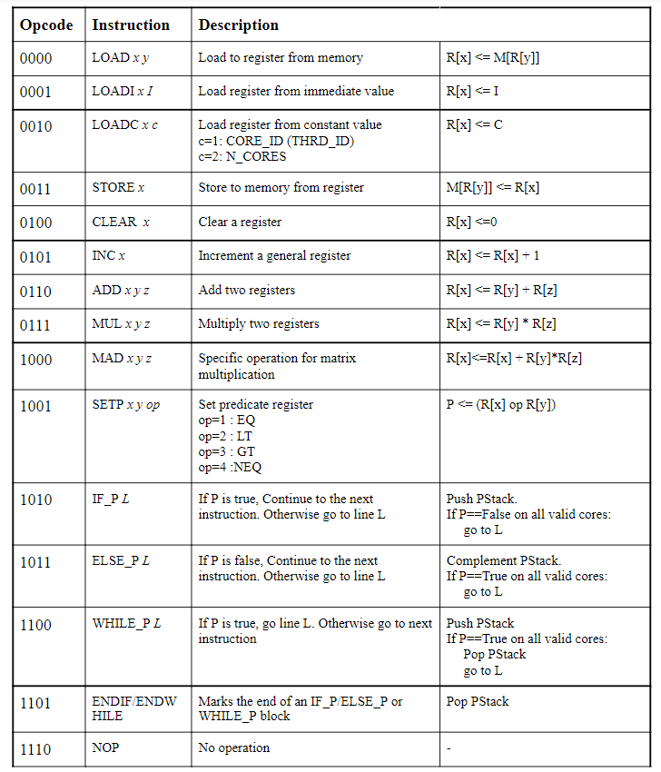

# Predicated-SIMD Processor

Designing a **Predicated-SIMD(Single Instruction Multiple Data) Processor** for 2D Matrix Multiplication, under the **EN3030 Circuits and Systems** module.

This repository contains
* Python programs for simulation of programs written in assembly language of the proposed Instruction Set Architecture (ISA)
* SystemVerilog implementation of the hardware modules
* Evaluation script for validating the design against a 2D matrix multiplication task

## Processor Design

### Instruction Set Architecture (ISA)

### Datapath

### RTL Modules

The information about the RTL Modules can be found [here](./Verilog/_Info.md).

## How to Run the Project

### Requirements

* Python 3
    * Numpy
* IcarusVerilog

### ISA Simulation

Find instructions [here](./Simulator/_INSTRUCTIONS.md).

### SystemVerilog Simulation
Find instructions [here](./Verilog/_INSTRUCTIONS.md).

### Evaluation

    python3 Evaluation/evaluation_script.py