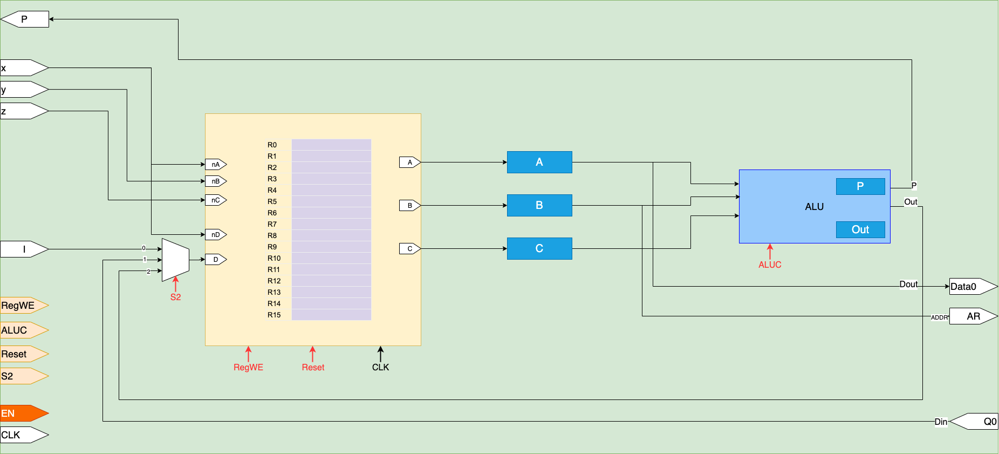

# RTL Modules

The inidividual RTL modules developed for this project are as follows and they also equip with corresponding testbenches.

1. SM Core
	1. Scheduler
		1. [Control Unit](./Verilog/Modules/SMCore/Scheduler/CU/README.md)
		2. Program Counter
		3. PStack
	1. SP Core 
		1.  ALU
		2.  Multiplexer
		3.  Register
2. Data Memory
3. Instruction Memory
4. Memory Controller

## Register File

### SPCore

#### Scheduler

##### Control Unit

# Instructions for compiling and simulation

## Instructions for using Icarus Verilog

Compilation

    iverilog -o module1.vvp module1_tb.v

Simulation

    vvp module1.vvp

Or Single Line Command (Windows Powershell)

    iverilog -o tb.vvp tb.v ; vvp tb.vvp

Displaying the Waveform - open the module1.vcd file using Scansion or GTKwave or any other VCD viewer

## Instructions for using Questa Sim

Compilation

Open a new project and add the module files along with the necessary testbench
If there is a hierachchy, arrange the files to that order 
Compile all the files

Simulation

	vsim -voptargs=""+acc"" <filename>
	
This creates a simulation with objects and the waveform of the shown

	vsim -debugDB <filename>

This creates a schematic of the simulated file